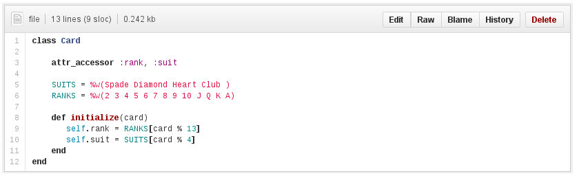

Create and Test a Deck of Cards
===============================

Deck model and Card model implented with simple  algorithm to generate
a deck of cards. Sparse testing of 2 example cases, length of card deck. 

Classes:
--------

*  Deck
*  Card

